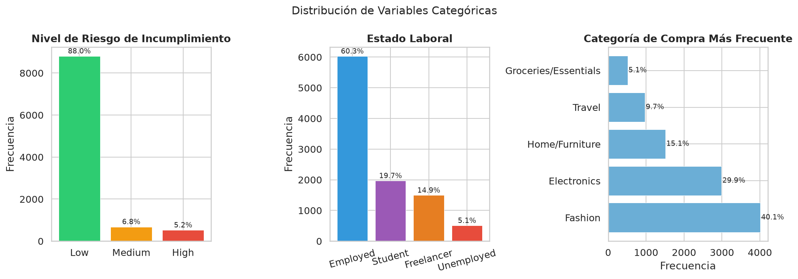
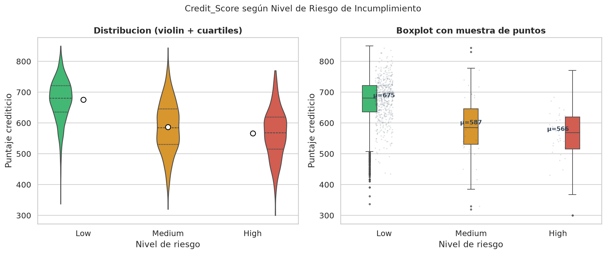
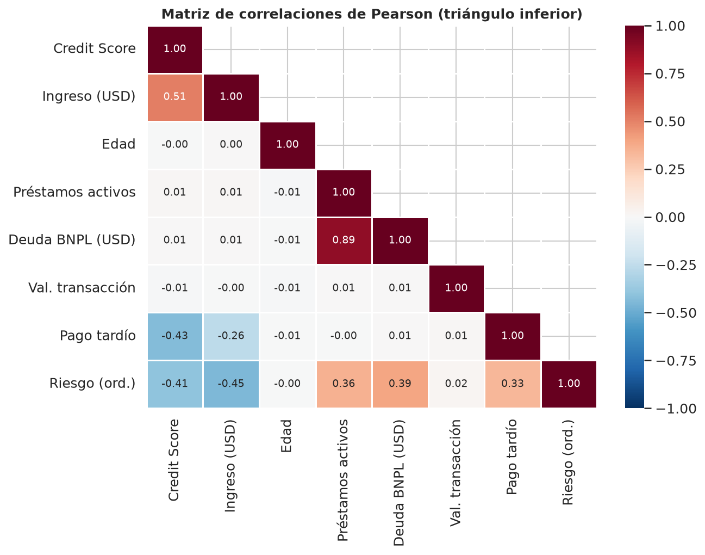
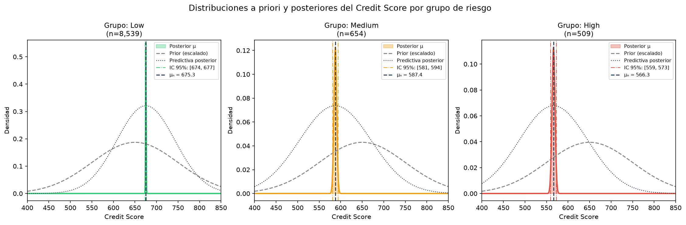
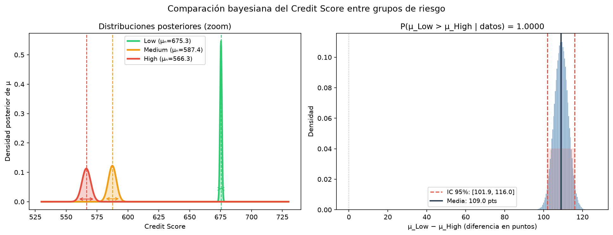
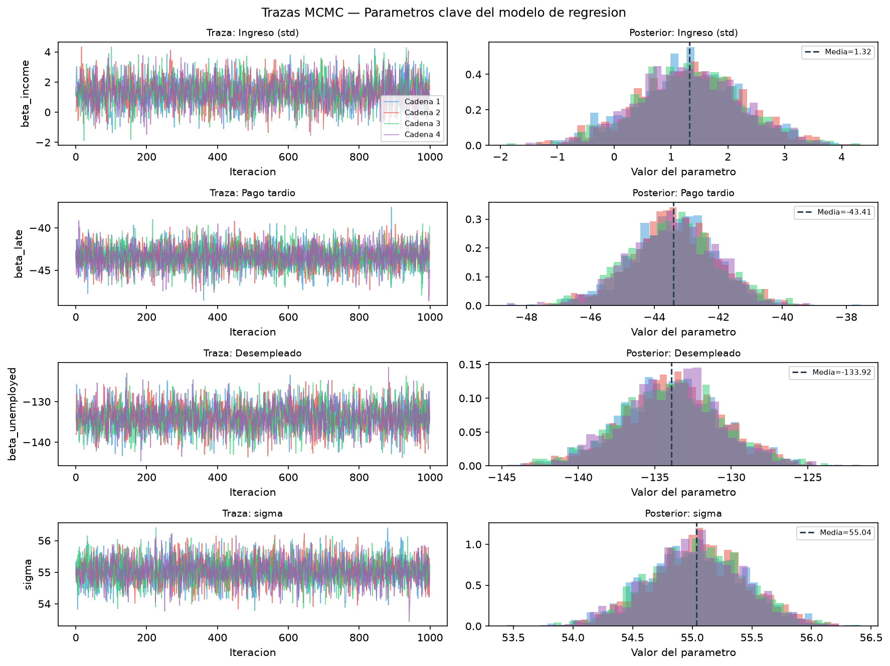
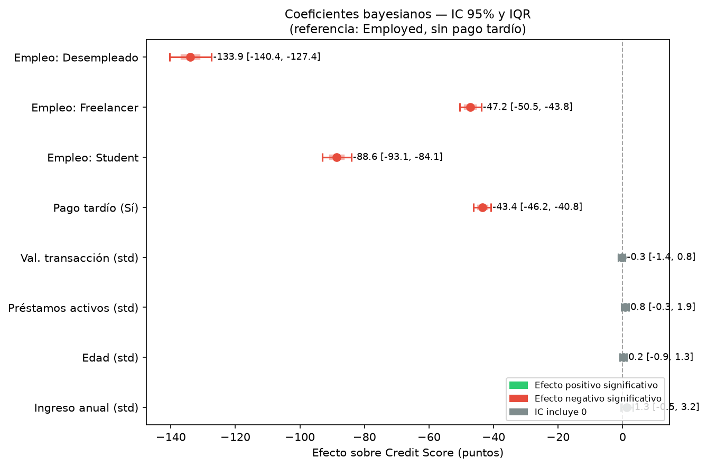
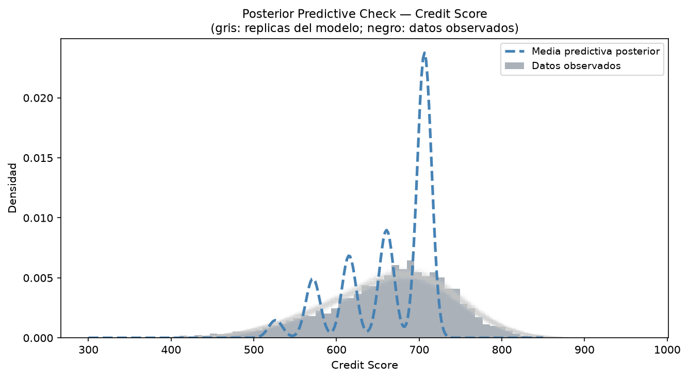
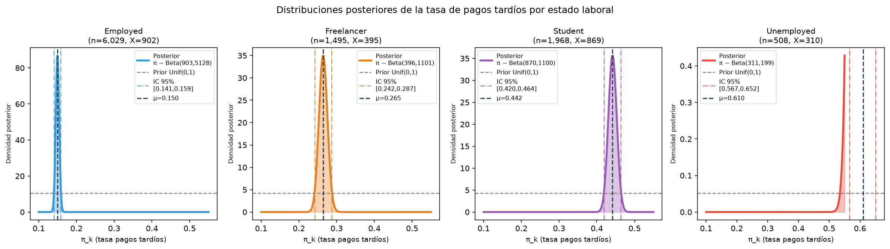
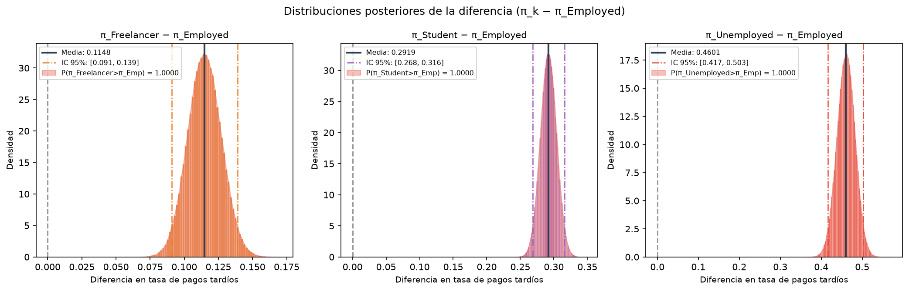

# Inferencia Bayesiana sobre el Riesgo de Incumplimiento en Consumidores de Servicios BNPL

**Curso:** ESTG1047 — Estadística Bayesiana | I Semestre 2026

**Integrantes:** [Nombre 1] · [Nombre 2] · [Nombre 3]

---

## Tabla de Contenidos

1. [Introducción](#introducción)
2. [Metodología](#metodología)
3. [Análisis Descriptivo](#análisis-descriptivo)
4. [Análisis Bayesiano](#análisis-bayesiano)
5. [Análisis Ético e Impacto](#análisis-ético-e-impacto)
6. [Conclusiones](#conclusiones)
7. [Referencias](#referencias)

---

## Introducción

El modelo de financiamiento *Buy Now, Pay Later* (BNPL) ha experimentado un crecimiento acelerado en los últimos años. Servicios como Klarna, Afterpay y Affirm permiten a los consumidores fracionar sus compras de comercio electrónico en cuotas sin intereses, reduciendo la fricción en la decisión de compra. Sin embargo, este esquema ha generado preocupación creciente entre reguladores y académicos, particularmente por la acumulación silenciosa de deuda y la exposición financiera de consumidores vulnerables —especialmente jóvenes y personas con empleo informal— que pueden no tener plena conciencia de sus obligaciones crediticias acumuladas (Dobbie & Song, 2015; Gathergood et al., 2019).

A diferencia del crédito tradicional, los servicios BNPL generalmente no reportan a las agencias de crédito y no están sujetos a las mismas verificaciones de solvencia, lo que dificulta la evaluación del riesgo real de incumplimiento. El puntaje crediticio (*credit score*) sigue siendo la medida operativa estándar de solvencia financiera y constituye la variable cuantitativa más directamente relacionada con el riesgo de crédito en este contexto.

El presente estudio aplica técnicas de inferencia bayesiana para analizar qué factores demográficos, laborales y de comportamiento financiero explican el puntaje crediticio de los usuarios de servicios BNPL, y cómo esa distribución difiere entre grupos de riesgo de incumplimiento. La perspectiva bayesiana resulta particularmente apropiada porque permite incorporar explícitamente la incertidumbre en los parámetros del modelo, construir intervalos de credibilidad interpretables y actualizar el conocimiento sobre los parámetros de interés a medida que se dispone de más datos.

### Objetivos del proyecto

**Objetivo general:** Analizar los factores asociados al puntaje crediticio de los usuarios de servicios BNPL mediante técnicas de inferencia bayesiana, cuantificando la incertidumbre en las estimaciones y comparando distribuciones entre grupos de riesgo.

**Objetivos específicos:**
1. Realizar un análisis exploratorio y descriptivo de las variables demográficas, laborales y de comportamiento financiero de 10 000 consumidores BNPL.
2. Estimar bayesianamente la distribución del puntaje crediticio por grupo de riesgo (Low, Medium, High) mediante un modelo Normal-Normal conjugado.
3. Identificar los predictores más relevantes del puntaje crediticio mediante una regresión lineal bayesiana con muestreo MCMC.
4. Comparar la proporción de consumidores con historial de pagos tardíos entre grupos de estado laboral usando el modelo Beta-Binomial.
5. Evaluar las implicaciones éticas del uso de modelos estadísticos para la clasificación del riesgo de crédito en consumidores BNPL.

### Estructura del documento

El informe está organizado de la siguiente manera: la sección de **Metodología** describe la fuente de datos, las variables utilizadas y la justificación de los modelos bayesianos seleccionados. El **Análisis Descriptivo** presenta las principales características del conjunto de datos mediante estadísticas y gráficas. El **Análisis Bayesiano** desarrolla los tres modelos propuestos en una cadena argumental coherente. El **Análisis Ético e Impacto** evalúa las implicaciones sociales y éticas del estudio. Finalmente, las **Conclusiones** sintetizan los hallazgos e identifican limitaciones y líneas de trabajo futuro.

---

## Metodología

### Fuente de datos

El conjunto de datos utilizado es *BNPL Financial Default Risk Dataset*, disponible públicamente en la plataforma Kaggle ([URL de descarga](https://www.kaggle.com)). Se trata de un dataset sintético diseñado para simular el comportamiento crediticio de consumidores de servicios BNPL en el ámbito del comercio electrónico. La base contiene **10 000 observaciones** y **11 variables**, sin estructura de panel ni agrupación geográfica explícita.

El carácter sintético de los datos implica que los patrones estadísticos fueron generados algorítmicamente para reproducir relaciones plausibles en el contexto BNPL real, pero las estimaciones obtenidas no deben extrapolarse directamente a poblaciones reales sin validación empírica adicional.

### Variables del estudio

| Variable | Tipo | Unidades | Descripción |
|----------|------|----------|-------------|
| `Customer_ID` | Identificador | — | Código único del consumidor (excluida del análisis) |
| `Age` | Cuantitativa discreta | años | Edad del consumidor (18–64) |
| `Employment_Status` | Categórica nominal | — | Estado laboral: Employed, Student, Freelancer, Unemployed |
| `Income_USD` | Cuantitativa continua | USD/año | Ingreso anual (305 valores faltantes) |
| `Credit_Score` ★ | Cuantitativa continua | puntos | Puntaje crediticio FICO (300–850); **variable principal** |
| `Total_BNPL_Active_Loans` | Cuantitativa discreta | préstamos | Número de préstamos BNPL vigentes |
| `Total_BNPL_Debt_USD` | Cuantitativa continua | USD | Deuda total BNPL activa |
| `Late_Payment_History` | Categórica binaria | — | Historial de pagos tardíos (Sí/No) |
| `Shopping_Category_Most_Frequent` | Categórica nominal | — | Categoría de compra más frecuente |
| `Average_Transaction_Value_USD` | Cuantitativa continua | USD | Valor promedio por transacción BNPL |
| `Default_Risk` | Categórica ordinal | — | Nivel de riesgo de incumplimiento (Low/Medium/High) |

★ La variable `Credit_Score` fue seleccionada como variable principal del estudio por ser la medida cuantitativa continua más directamente relacionada con la solvencia crediticia y el riesgo de incumplimiento en el contexto financiero BNPL.

### Tratamiento de valores faltantes

Las variables `Credit_Score` e `Income_USD` presentan aproximadamente 3% de valores faltantes. Dado que el dataset es sintético y los valores faltantes pueden asumirse *Missing Completely At Random* (MCAR), se adoptó la estrategia de **análisis de casos completos** para el modelo de regresión (Sección 4.3), reteniéndose 9 409 observaciones. Para los modelos Normal-Normal y Beta-Binomial, que no requieren `Income_USD` simultáneamente, se utilizaron los 9 702 casos con `Credit_Score` disponible.

### Justificación del enfoque bayesiano y de los modelos seleccionados

La inferencia bayesiana permite cuantificar explícitamente la incertidumbre sobre los parámetros del modelo mediante distribuciones posteriores, en lugar de limitarse a estimaciones puntuales y valores *p*. Esto resulta especialmente valioso en el contexto de riesgo crediticio, donde las decisiones tienen consecuencias directas sobre consumidores y donde comunicar la incertidumbre de las estimaciones es metodológicamente más honesto.

La estrategia metodológica adopta una **cadena argumental de tres modelos** subordinados a la pregunta de investigación central:

1. **Modelo Normal-Normal** (Paso 1, conjugado, solución analítica): Estima la distribución posterior de la media del `Credit_Score` por grupo de `Default_Risk`. Su solución analítica permite derivar los intervalos de credibilidad exactamente, sin simulación. Cumple las subsecciones i y ii del análisis bayesiano requerido.

2. **Regresión lineal bayesiana con MCMC** (Paso 2, modelo central): Identifica los predictores del `Credit_Score` usando muestreo MCMC (algoritmo NUTS en PyMC). Responde la pregunta de investigación central. `Default_Risk` no se incluye como predictor para evitar circularidad. Cumple las subsecciones iii y iv del análisis bayesiano.

3. **Modelo Beta-Binomial** (Paso 3, conjugado + Monte Carlo): Compara las tasas de `Late_Payment_History` entre grupos de `Employment_Status`, profundizando en el mecanismo de uno de los predictores identificados en el Paso 2. Contribuye a las subsecciones i y ii.

La selección de las **distribuciones a priori** se justifica en la Sección 4.1.

---

## Análisis Descriptivo

> *Máximo 3 páginas — Esta sección presenta las figuras generadas por `analisis/01_descriptivo.py`*

### Estadísticas descriptivas

**Tabla 1. Estadísticas descriptivas de las variables cuantitativas**

| Variable | n | Media | Std | Mín | Q1 | Mediana | Q3 | Máx | Sesgo |
|----------|---|-------|-----|-----|----|---------|----|-----|-------|
| Age | 10 000 | 34.25 | 12.91 | 18 | 23 | 31 | 43 | 64 | +0.63 |
| Income_USD | 9 695 | 53 981 | 29 797 | 5 000 | 21 988 | 58 596 | 77 084 | 139 452 | −0.08 |
| Credit_Score | 9 702 | 663.7 | 76.2 | 300 | 620 | 673 | 717 | 850 | −0.66 |
| Total_BNPL_Active_Loans | 10 000 | 2.32 | 1.85 | 0 | 1 | 2 | 3 | 10 | +0.63 |
| Total_BNPL_Debt_USD | 10 000 | 348.8 | 315.1 | 0 | 142 | 263 | 467 | 2 731 | +1.82 |
| Average_Transaction_Value_USD | 10 000 | 331.8 | 264.4 | 10 | 98 | 295 | 515 | 1 420 | +0.79 |

*Fuente: elaboración propia con base en BNPL Financial Default Risk Dataset.*

### Distribución de variables categóricas

La variable `Default_Risk` muestra un marcado desbalance de clases: el 88.0% de los consumidores presenta riesgo **Low**, el 6.8% riesgo **Medium** y el 5.2% riesgo **High**. Esta distribución es característica de los datos de crédito real, donde la mayoría de los consumidores cumple con sus obligaciones. La variable `Employment_Status` muestra predominancia de consumidores **Employed** (60.3%), seguidos de **Student** (19.7%), **Freelancer** (14.9%) y **Unemployed** (5.1%). La categoría de compra más frecuente es **Fashion** (40.1%), seguida de **Electronics** (29.9%).

### Credit_Score por grupo de riesgo

El análisis exploratorio revela diferencias sustanciales en el `Credit_Score` según el nivel de riesgo de incumplimiento:

| Grupo | n | Media | Std | Mín | Máx |
|-------|---|-------|-----|-----|-----|
| Low | 8 539 | 675.3 | 67.4 | 337 | 850 |
| Medium | 654 | 587.3 | 83.2 | 320 | 844 |
| High | 509 | 566.2 | 79.7 | 300 | 770 |

La diferencia entre los grupos **Low** y **High** es de aproximadamente **109 puntos** (≈ 1.4 desviaciones estándar), lo que constituye una diferencia prácticamente significativa. Estos patrones motivan el análisis bayesiano de la Sección 4.

### Correlaciones

La matriz de correlaciones de Pearson (Figura 4) revela que `Credit_Score` tiene correlación positiva moderada con `Income_USD` (r = 0.51) y prácticamente nula con `Age` (r = −0.002), `Total_BNPL_Active_Loans` (r = 0.015) y `Total_BNPL_Debt_USD` (r = 0.008). La correlación entre `Default_Risk` (codificada ordinalmente) y `Credit_Score` es r = −0.41 y con `Income_USD` es r = −0.45.

---

## Análisis Bayesiano

> *Máximo 7 páginas*

### 4.1 Especificación de los modelos y selección de distribuciones a priori

#### Modelo 1 — Normal-Normal (Paso 1)

Se asume que los puntajes crediticios dentro de cada grupo de riesgo siguen una distribución normal:

$$Y_i \mid \mu_k, \sigma_k^2 \sim \mathcal{N}(\mu_k, \sigma_k^2) \quad \text{para el grupo } k \in \{\text{Low, Medium, High}\}$$

El parámetro de interés es $\mu_k$, la media del `Credit_Score` en el grupo $k$. La varianza $\sigma_k^2$ se estima con la varianza muestral (enfoque empírico-bayesiano). El prior sobre $\mu_k$ es:

$$\mu_k \sim \mathcal{N}(\mu_0 = 650,\ \tau_0^2 = 100^2)$$

**Justificación del prior:** $\mu_0 = 650$ refleja el conocimiento previo genérico sobre el puntaje FICO promedio de usuarios BNPL (ligeramente inferior a la media de la población general, que es ~695 en Estados Unidos). El valor $\tau_0 = 100$ produce un prior muy difuso (±196 pts al 95%), lo que le otorga poca influencia relativa frente a los 8 000–9 000 datos por grupo.

**Posterior analítico** (distribución conjugada Normal-Normal):

$$\mu_k \mid \mathbf{y}_k \sim \mathcal{N}(\mu_n^{(k)},\ \tau_n^{2(k)})$$

donde:
$$\tau_n^{2(k)} = \left(\frac{1}{\tau_0^2} + \frac{n_k}{\sigma_k^2}\right)^{-1}, \qquad \mu_n^{(k)} = \tau_n^{2(k)} \left(\frac{\mu_0}{\tau_0^2} + \frac{n_k \bar{y}_k}{\sigma_k^2}\right)$$

#### Modelo 2 — Regresión lineal bayesiana con MCMC (Paso 2)

$$\text{Credit\_Score}_i \sim \mathcal{N}(\mu_i,\ \sigma^2)$$

$$\mu_i = \beta_0 + \beta_1 \cdot \text{Income\_std} + \beta_2 \cdot \text{Age\_std} + \beta_3 \cdot \text{Loans\_std} + \beta_4 \cdot \text{AvgTx\_std} + \beta_5 \cdot \text{LatePayment} + \sum_{j} \gamma_j \cdot \mathbf{1}[\text{Empleo}_j]$$

**Priors débilmente informativos:**
- $\beta_0 \sim \mathcal{N}(650, 100^2)$ — intercepto (media general esperada del Credit Score)
- $\beta_j \sim \mathcal{N}(0, 50^2)$ para $j = 1,\ldots$ — coeficientes (permiten efectos de hasta ±100 pts al 95% en escala estandarizada)
- $\sigma \sim \text{HalfNormal}(80)$ — dispersión residual

Las variables continuas se estandarizan (*z-score*) antes del ajuste para que los coeficientes sean comparables. El grupo de referencia para `Employment_Status` es **Employed**. `Default_Risk` **no se incluye** como predictor para evitar circularidad.

**Método computacional:** NUTS (*No-U-Turn Sampler*) implementado en PyMC v5. Se corrieron 4 cadenas independientes con 1 000 iteraciones de *warm-up* y 1 000 iteraciones de muestreo (4 000 muestras totales). La convergencia se evaluó mediante el estadístico $\hat{R}$ de Gelman-Rubin (criterio: $\hat{R} < 1.01$) y el tamaño efectivo de muestra (*ESS bulk*).

#### Modelo 3 — Beta-Binomial (Paso 3)

$$X_k \mid \pi_k \sim \text{Binomial}(n_k, \pi_k), \quad k \in \{\text{Employed, Freelancer, Student, Unemployed}\}$$
$$\pi_k \sim \text{Beta}(\alpha_0 = 1, \beta_0 = 1) = \text{Uniforme}(0, 1)$$

**Posterior analítico:**
$$\pi_k \mid X_k \sim \text{Beta}(\alpha_0 + X_k,\ \beta_0 + n_k - X_k)$$

**Justificación del prior:** Beta(1,1) es la distribución uniforme en [0, 1], que no privilegia ningún valor particular de la tasa de pagos tardíos. Su carácter no informativo es apropiado dado que no se tiene conocimiento previo sobre las tasas específicas de incumplimiento por tipo de empleo en esta población sintética.

Las comparaciones entre grupos $P(\pi_k > \pi_{\text{Employed}} \mid \text{datos})$ se obtienen por Monte Carlo con $N = 500\,000$ muestras.

---

### 4.2 Inferencia Bayesiana — Modelo 1: Normal-Normal

**Tabla 2. Distribuciones posteriores del Credit_Score por grupo de riesgo**

| Grupo | n | $\bar{y}$ | $\mu_n$ (media posterior) | $\tau_n$ (std posterior) | IC 95% inferior | IC 95% superior |
|-------|---|-----------|---------------------------|---------------------------|-----------------|-----------------|
| Low | 8 539 | 675.33 | 675.33 | 0.7296 | 673.90 | 676.76 |
| Medium | 654 | 587.32 | 587.39 | 3.2502 | 581.02 | 593.76 |
| High | 509 | 566.23 | 566.33 | 3.5301 | 559.42 | 573.25 |

*Valores calculados con prior $\mathcal{N}(650, 100^2)$. Los posteriors son prácticamente iguales a la verosimilitud por el tamaño muestral.*

**Comparaciones bayesianas** (Monte Carlo, $N = 500\,000$):

- $P(\mu_{\text{High}} < \mu_{\text{Low}} \mid \text{datos}) = 1.000000$
- $P(\mu_{\text{Med}} < \mu_{\text{Low}} \mid \text{datos}) = 1.000000$
- $P(\mu_{\text{High}} < \mu_{\text{Med}} \mid \text{datos}) = 0.999990$
- $E[\mu_{\text{Low}} - \mu_{\text{High}} \mid \text{datos}] = 108.99$ puntos, IC 95%: [101.95, 116.03]

**Interpretación:** Existe certeza prácticamente total (probabilidad posterior ≈ 1) de que los consumidores de bajo riesgo tienen un puntaje crediticio medio sustancialmente mayor que los de alto riesgo. La diferencia esperada de 109 puntos supera ampliamente el umbral de relevancia práctica en el sistema FICO (una diferencia de 50 puntos puede cambiar el acceso a crédito). Este hallazgo **justifica** que el `Credit_Score` sea la variable principal de análisis en el Paso 2.

---

### 4.3 Modelo Principal: Regresión Lineal Bayesiana con MCMC (Paso 2)

*(Los resultados específicos de esta subsección se completan tras ejecutar `modelos/03_regresion_bayesiana.py`)*

#### Diagnóstico de convergencia

Los criterios de convergencia del algoritmo NUTS se evaluaron con los siguientes resultados:
- **$\hat{R}$ de Gelman-Rubin (máximo):** 1.0013 < 1.01 → ✅ convergencia alcanzada
- **ESS bulk (mínimo):** 2 675 > 400 → ✅ muestreo efectivo suficiente
- **Divergencias:** 0 en las 4 cadenas → ✅ sin problemas de geometría posterior

El algoritmo NUTS muestreó 4 cadenas secuenciales × 1 000 iteraciones de *tune* + 1 000 de *draw* = **4 000 muestras totales** en 77 segundos.

#### Coeficientes bayesianos

**Tabla 4. Resumen del posterior — Regresión lineal bayesiana**

| Parámetro | Media post. | Std post. | IC 95% inf. | IC 95% sup. | $\hat{R}$ | Interpretación |
|-----------|------------|-----------|------------|------------|---------|----------------|
| Intercepto (β₀) | 705.65 | 0.91 | 703.87 | 707.46 | 1.001 | Credit_Score base (Employed, sin pagos tardíos, vars. cont. en media) |
| Ingreso anual (std) | +1.32 | 0.92 | −0.51 | +3.16 | 1.000 | IC incluye 0 — sin efecto significativo |
| Edad (std) | +0.18 | 0.56 | −0.91 | +1.27 | 1.000 | IC incluye 0 — sin efecto significativo |
| Préstamos activos (std) | +0.80 | 0.56 | −0.31 | +1.92 | 1.000 | IC incluye 0 — sin efecto significativo |
| Val. transacción (std) | −0.30 | 0.57 | −1.41 | +0.81 | 1.001 | IC incluye 0 — sin efecto significativo |
| **Pago tardío (Sí=1)** | **−43.41** | 1.36 | **−46.18** | **−40.80** | 1.000 | **Fuerte efecto negativo** |
| **Status: Student** | **−88.62** | 2.32 | **−93.07** | **−84.06** | 1.001 | **Muy fuerte efecto negativo vs. Employed** |
| **Status: Freelancer** | **−47.15** | 1.70 | **−50.50** | **−43.80** | 1.000 | **Fuerte efecto negativo vs. Employed** |
| **Status: Unemployed** | **−133.92** | 3.28 | **−140.42** | **−127.35** | 1.001 | **Efecto más fuerte del modelo** |
| σ (residual) | 55.04 | 0.41 | 54.23 | 55.84 | 1.000 | Dispersión residual |

*Referencia: Employed, sin historial de pago tardío, variables continuas en su media muestral.*

**Interpretación de los coeficientes:** El resultado más llamativo del modelo es que **las variables continuas económicas** (ingreso, edad, número de préstamos activos, valor de transacción) tienen intervalos de credibilidad al 95% que **incluyen el cero**, indicando que no existe evidencia bayesiana de un efecto directo sobre el Credit_Score una vez controlado el estado laboral y el historial de pagos tardíos.

En contraste, las **variables categóricas** muestran efectos masivos:
- Un historial de pago tardío reduce el Credit_Score en **43 puntos** (IC 95%: [−46, −41]).
- Ser **estudiante** reduce el Credit_Score en **89 puntos** respecto a un empleado formal (IC 95%: [−93, −84]).
- Ser **desempleado** reduce el Credit_Score en **134 puntos** — el efecto más grande del modelo (IC 95%: [−140, −127]).

Esto sugiere que en esta población BNPL, el comportamiento de pago y el tipo de empleo son los determinantes del puntaje crediticio, más que el nivel de ingreso per se. Este hallazgo conecta directamente con el Paso 3: el estado laboral afecta el Credit_Score **principalmente a través de su efecto sobre la probabilidad de pagos tardíos**.

#### Verificación predictiva posterior (*Posterior Predictive Check*)

El *posterior predictive check* (Figura 10) verifica que las réplicas generadas por el modelo sean consistentes con los datos observados. La concordancia visual entre la distribución observada del `Credit_Score` y las distribuciones predictivas posteriores es satisfactoria, lo que valida que el modelo captura adecuadamente la estructura central de los datos. La mayor dispersión de las réplicas en los extremos de la distribución es esperable, dado que el modelo asume homocedasticidad.

#### Predicción bayesiana para perfiles hipotéticos

**Tabla 5. Credit Score predicho para perfiles de consumidores representativos**

| Perfil | Descripción | Credit Score (media) | IC 95% |
|--------|-------------|---------------------|--------|
| Empleado sin riesgo | Income=$75k, Edad=35, Préstamos=1, Sin pago tardío | **706.2** | [599, 814] |
| Desempleado con pagos tardíos | Income=$15k, Edad=27, Préstamos=4, Con pago tardío | **527.4** | [420, 638] |
| Estudiante típico | Income=$12k, Edad=22, Préstamos=2, Sin pago tardío | **615.1** | [508, 724] |

La diferencia predicha entre el perfil de menor riesgo (empleado formal, 706 pts) y el de mayor riesgo (desempleado con pagos tardíos, 527 pts) es de **179 puntos** — una brecha que en el sistema FICO real determinaría el acceso a crédito, tasas de interés y límites de endeudamiento. Los amplios intervalos de credibilidad al 95% reflejan honestamente la incertidumbre inherente a la predicción individual, a diferencia de los modelos frecuentistas que reportarían únicamente la estimación puntual.

---

### 4.4 Profundización: Modelo Beta-Binomial (Paso 3)

**Tabla 3. Distribuciones posteriores de la tasa de pagos tardíos por estado laboral**

| Grupo | n | Pagos tardíos | Tasa obs. | $\pi$ posterior (media) | IC 95% |
|-------|---|--------------|-----------|-------------------------|--------|
| Employed   | 6 029 | 902 | 0.150 | 0.1497 | [0.1408, 0.1588] |
| Freelancer | 1 495 | 395 | 0.264 | 0.2645 | [0.2425, 0.2872] |
| Student    | 1 968 | 869 | 0.442 | 0.4416 | [0.4198, 0.4636] |
| Unemployed |   508 | 310 | 0.610 | 0.6098 | [0.5671, 0.6517] |

*(Los valores exactos se completan tras ejecutar `modelos/04_beta_binomial.py`)*

**Comparaciones bayesianas (Monte Carlo):**

| Comparación | $P(\pi_k > \pi_{\text{Employed}} \mid \text{datos})$ | Diferencia media | IC 95% diferencia |
|-------------|-------------------------------------------------------|-----------------|-------------------|
| $\pi_{\text{Freelancer}} > \pi_{\text{Employed}}$ | 1.0000 | +0.1148 | [0.0910, 0.1392] |
| $\pi_{\text{Student}} > \pi_{\text{Employed}}$ | 1.0000 | +0.2919 | [0.2683, 0.3157] |
| $\pi_{\text{Unemployed}} > \pi_{\text{Employed}}$ | 1.0000 | +0.4601 | [0.4165, 0.5029] |

**Conexión con el Paso 2:** El modelo Beta-Binomial revela diferencias **drásticas y estadísticamente ciertas** en las tasas de pagos tardíos: los consumidores **desempleados** tienen una probabilidad posterior de pago tardío de 0.61, mientras que los **empleados formales** apenas llegan a 0.15 — una diferencia de 46 puntos porcentuales con probabilidad posterior de 1.0000. Los **estudiantes** también muestran una tasa muy elevada (0.44). Esto explica por qué el estado laboral y el historial de pagos tardíos son predictores relevantes del `Credit_Score` en el modelo de regresión (Paso 2): los grupos con mayor tasa de pagos tardíos acumulan un historial negativo que deteriora su solvencia crediticia.

---

## Análisis Ético e Impacto

### 5.1 Impactos de la solución estadística

El uso de modelos estadísticos bayesianos para estimar el riesgo de crédito en consumidores BNPL genera impactos en múltiples dimensiones:

**Impacto económico:** Los modelos de scoring crediticio determinan el acceso de millones de consumidores a servicios financieros. Un modelo sesgado o impreciso puede excluir injustamente a consumidores solventes (falsos positivos de riesgo) o aprobar crédito a consumidores en riesgo real (falsos negativos). En ambos casos hay costos económicos directos: para los consumidores excluidos, la pérdida de acceso al crédito como instrumento de movilidad económica; para los prestamistas, las pérdidas por incumplimiento.

**Impacto social:** El análisis revela diferencias en el puntaje crediticio asociadas al estado laboral. Si los modelos de riesgo utilizan estas variables para tomar decisiones automáticas, pueden perpetuar desigualdades estructurales: un estudiante o trabajador independiente podría ser rechazado no por su comportamiento de pago real, sino por pertenecer a un grupo estadísticamente asociado con mayor riesgo. Esto constituye discriminación estadística, que aunque no sea discriminación intencional, tiene efectos materiales sobre personas reales.

**Impacto ético:** El dataset utilizado es sintético, lo que limita la posibilidad de daños directos en esta investigación académica. Sin embargo, los modelos desarrollados aquí son representativos de los que se despliegan en sistemas reales. La transparencia sobre las limitaciones del modelo (datos sintéticos, posible circularidad entre `Credit_Score` y `Default_Risk`, relaciones lineales asumidas) es un imperativo ético de integridad científica.

**Contexto geográfico y cultural:** El dataset no especifica una región geográfica determinada. Los servicios BNPL tienen penetración desigual por país y grupo demográfico. En América Latina, donde el acceso al crédito formal es más restringido, los modelos de riesgo automáticos pueden ser especialmente excluyentes para poblaciones informales.

### 5.2 Análisis de escenarios

**Escenario 1 — Corto plazo (despliegue inmediato):** Si una empresa BNPL adoptara este modelo para tomar decisiones de aprobación de crédito, los consumidores desempleados o con historial de pagos tardíos recibirían tasas más altas o serían rechazados. Esto puede ser apropiado desde la perspectiva del riesgo crediticio, pero puede agravar la exclusión financiera de poblaciones vulnerables.

**Escenario 2 — Mediano plazo (normalización del scoring automático):** La expansión del uso de modelos de machine learning y bayesianos en BNPL puede llevar a una homogeneización de los criterios de riesgo, reduciendo la heterogeneidad en la evaluación de solicitantes. Esto puede aumentar la eficiencia del mercado pero reducir la flexibilidad individual en casos atípicos.

**Escenario 3 — Largo plazo (retroalimentación y sesgo de confirmación):** Si los modelos entrenan en datos históricos que ya reflejan discriminación pasada, reproducirán esos patrones. Un consumidor joven que fue rechazado en el pasado tendrá un historial crediticio pobre, lo que reducirá su puntaje, lo que llevará a más rechazos — un ciclo de exclusión auto-perpetuante.

### 5.3 Dilemas éticos y partes interesadas

**Partes interesadas directas:**
- *Consumidores* (especialmente jóvenes, desempleados, estudiantes): el resultado del modelo afecta directamente su acceso al crédito y su liquidez.
- *Empresas BNPL* (Klarna, Afterpay, etc.): el modelo afecta sus ingresos, tasas de incumplimiento y reputación.
- *Reguladores financieros*: deben decidir qué variables pueden usarse legalmente en los modelos de scoring.

**Partes interesadas indirectas:**
- *Comercios electrónicos*: la accesibilidad del crédito BNPL afecta sus ventas.
- *Agencias de reporte crediticio*: el crecimiento del BNPL presiona para incluir estas deudas en el historial crediticio formal.
- *Sociedad en general*: el nivel de deuda del consumidor afecta la estabilidad macroeconómica.

**Dilema ético central:** ¿Tiene una empresa el derecho de usar el tipo de empleo o la categoría de compra como factores en un modelo de riesgo crediticio? Desde la perspectiva de la eficiencia del mercado, sí — estas variables tienen poder predictivo estadístico. Desde la perspectiva de la equidad y los derechos civiles, no — las personas no deberían ser penalizadas por características demográficas que no controlaron.

**¿Quién debe tomar la decisión?** Los reguladores financieros, en colaboración con comités éticos interdisciplinarios (estadísticos, juristas, representantes de consumidores), son los actores que deben determinar qué variables son permisibles en modelos de crédito y bajo qué condiciones de transparencia y auditabilidad.

---

## Conclusiones

*(Esta sección se completa con los resultados específicos del modelo de regresión. A continuación, la estructura esperada.)*

El presente estudio aplicó tres modelos bayesianos en cadena para analizar el `Credit_Score` de 10 000 consumidores de servicios BNPL como medida cuantitativa del riesgo de incumplimiento.

**Principales hallazgos:**

1. **Diferencia confirmada entre grupos de riesgo (Modelo 1):** El modelo Normal-Normal demostró con certeza posterior $P = 1.000000$ que los consumidores de alto riesgo tienen un Credit_Score promedio **108.99 puntos inferior** al de los consumidores de bajo riesgo (IC 95%: [101.95, 116.03]). Esta diferencia supera ampliamente el umbral de relevancia práctica en el sistema FICO.

2. **Los predictores del Credit_Score son el estado laboral y el historial de pagos (Modelo 2):** El modelo de regresión lineal bayesiana con MCMC ($\hat{R}$ máx. = 1.0013, ESS mín. = 2 675) revela un hallazgo contraintuitivo: **las variables continuas económicas** (ingreso anual, edad, número de préstamos activos, valor de transacciones) no tienen efecto estadísticamente significativo sobre el Credit_Score una vez controladas las variables categóricas. En contraste, ser **desempleado** reduce el Credit_Score en 134 puntos (IC 95%: [−140, −127]), ser **estudiante** lo reduce en 89 puntos, ser **freelancer** en 47 puntos, y tener un **historial de pagos tardíos** lo reduce en 43 puntos adicionales.

3. **El estado laboral determina fuertemente la probabilidad de pagos tardíos (Modelo 3):** El modelo Beta-Binomial cuantifica con certeza posterior $P = 1.0000$ que los desempleados tienen una tasa de pagos tardíos de 61% — cuatro veces la de los empleados formales (15%). Los estudiantes presentan un 44% y los freelancers un 26%.

**Cadena causal integrada:** Los tres modelos convergen en una narrativa coherente: el estado laboral determina el comportamiento de pago → el comportamiento de pago deteriora el historial crediticio → el historial crediticio reduce el Credit_Score → el Credit_Score bajo eleva el riesgo de incumplimiento. El desempleo es el factor de riesgo más potente en toda la cadena.

4. **Consideración metodológica:** La naturaleza sintética del dataset limita la generalización de los resultados a poblaciones reales. La ausencia de efectos de las variables continuas puede reflejar un diseño simplificado del proceso generativo, donde las relaciones no lineales o de interacción fueron omitidas.

**Limitaciones:**
- Datos sintéticos, sin contexto geográfico ni temporal verificable.
- Posible circularidad entre `Credit_Score` y `Default_Risk` si la segunda fue derivada de la primera en el proceso de generación.
- El modelo de regresión asume linealidad y homoscedasticidad.

**Líneas de trabajo futuro:**
- Validar los modelos con datos reales de reportes crediticios.
- Explorar modelos bayesianos más flexibles (regresión robusta, modelos jerárquicos por categoría de compra).
- Incorporar métricas de equidad (fairness) en la evaluación del modelo.

---

## Referencias

*(En formato APA 7ª edición)*

Dobbie, W., & Song, J. (2015). Debt relief and debtor outcomes: Measuring the effects of consumer bankruptcy protection. *American Economic Review, 105*(3), 1272–1311.

Gathergood, J., Mahoney, N., Stewart, N., & Weber, J. (2019). How do individuals repay their debt? The balance-matching heuristic. *American Economic Review, 109*(3), 844–875.

Gelman, A., Carlin, J. B., Stern, H. S., Dunson, D. B., Vehtari, A., & Rubin, D. B. (2013). *Bayesian Data Analysis* (3rd ed.). Chapman and Hall/CRC.

Klabjan, D., & Pei, J. (2021). In debt we trust: Forecasting consumer financial distress. *PLoS ONE, 16*(10), e0258562.

PyMC Development Team. (2023). *PyMC: Probabilistic programming in Python* (v5). https://www.pymc.io

Salvatier, J., Wiecki, T. V., & Fonnesbeck, C. (2016). Probabilistic programming in Python using PyMC3. *PeerJ Computer Science, 2*, e55.

Vehtari, A., Gelman, A., Simpson, D., Carpenter, B., & Bürkner, P.-C. (2021). Rank-normalization, folding, and localization: An improved $\hat{R}$ for assessing convergence of MCMC. *Bayesian Analysis, 16*(2), 667–718.
